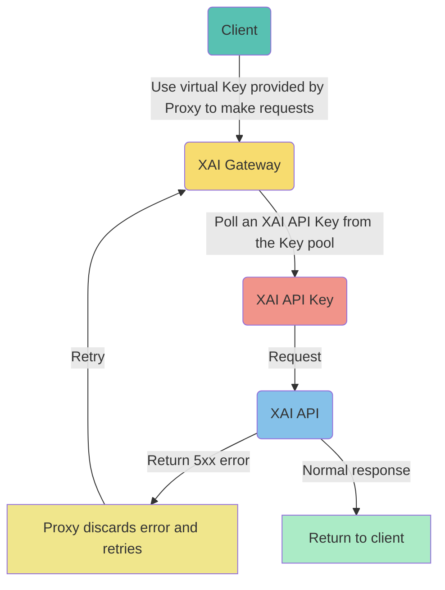
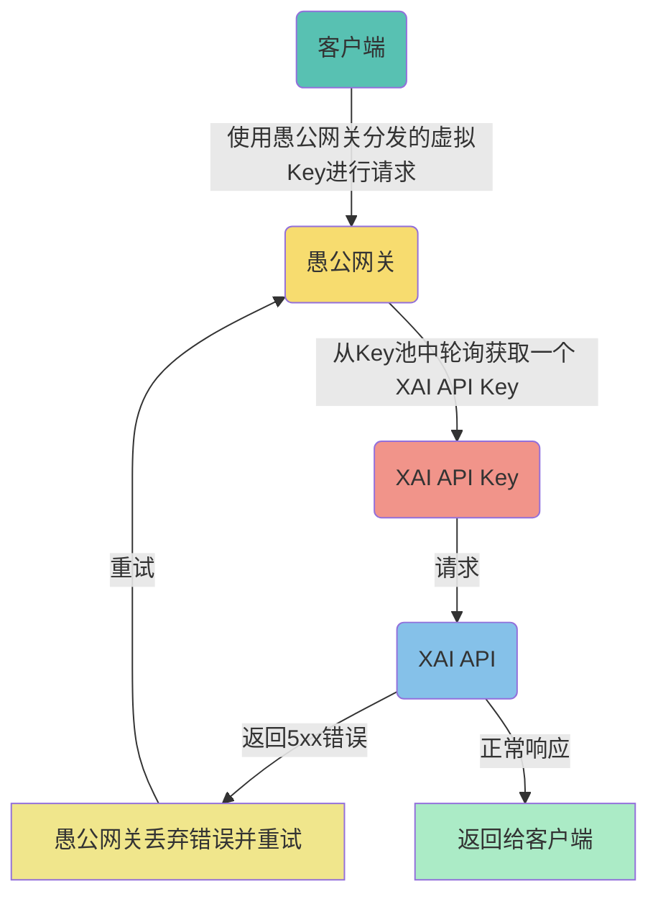

# ProxyXAI

ProxyXAI is an AI API Gateway service that provides unified access to multiple AI providers (OpenAI, Anthropic, etc.) with enhanced features like load balancing, rate limiting, usage tracking, and subaccount management.

## Implementation Principle



## Resource Dependencies

Recommended AWS t3.small, t3.micro, or other 2-core 2G overseas hosts, with a minimum configuration requirement of 1-core 1G.

## Environment Installation

Depends on the docker environment and docker-compose container management tool.

```
1. yum -y install docker
2. curl -L https://github.com/docker/compose/releases/latest/download/docker-compose-$(uname -s)-$(uname -m) -o /usr/local/bin/docker-compose
3. chmod +x /usr/local/bin/docker-compose
4. curl -L https://raw.githubusercontent.com/proxyxai/xai/main/docker-compose.yml -o docker-compose.yml
5. docker-compose -f docker-compose.yml up -d
```

## Special Note

By default, the docker-compose.yml file sets XAI_BASE to api.openai.com. Therefore, you need to input the API Keys obtained from the official OpenAI platform. If you need to use API Keys from other proxy providers, you should change XAI_BASE to the corresponding service node address, such as api.xxx.xxx. We call this usage method "multi-level cascading deployment," while the default method of proxying to the official node api.openai.com is called "single-level cascading deployment."

---

# ProxyXAI

ProxyXAI 是一个 AI API Gateway，提供对多个 AI 提供商（OpenAI、Anthropic 等）的统一访问，并具备负载均衡、速率限制、使用情况跟踪和子账户管理等增强功能。

## 实现原理



## 资源依赖

推荐 AWS t3.small, t3.micro 等机型，或者一般 2核2G 配置的海外主机(可以调用官方 API 的地区)，最低配置要求 1核1G。

## 环境安装

依赖 docker 环境以及 docker-compose 容器管理工具。

```
1. yum -y install docker
2. curl -L https://github.com/docker/compose/releases/latest/download/docker-compose-$(uname -s)-$(uname -m) -o /usr/local/bin/docker-compose
3. chmod +x /usr/local/bin/docker-compose
4. curl -L https://raw.githubusercontent.com/proxyxai/xai/main/docker-compose.yml -o docker-compose.yml
5. docker-compose -f docker-compose.yml up -d
```

## 特别说明

默认情况下，docker-compose.yml 文件里将 XAI_BASE 设置为 https://api.openai.com, 因此，您需要输入从 OpenAI 官方平台获取的 API Key,如果您需要使用来自其他代理提供商的 API Key，您应将 XAI_BASE 更改为相应的服务节点地址，例如 https://api.xxx.xxx, 我们将这种使用方法称为“多级串联部署”，而代理到官方节点 https://api.openai.com 的方法称为“一级串联部署”。
